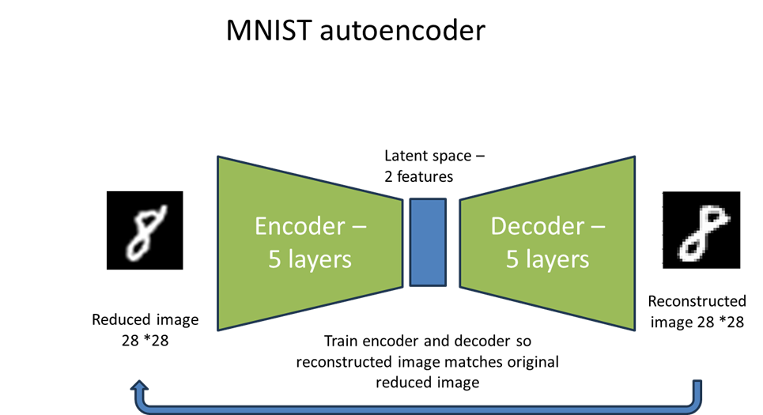

# MNIST dimensionality reduction"
A key concept in **Machine Learning** is reducing the dimensionality of objects to the key features
This is an example with MNIST digits, 28*28 pixel hand written digits'
In this example MNIST digits are reconstructed used a Keras autoencoder with only two features in the latent space.
The impact of changing the feature values and running the decoder to reconstruct the images can be found

This work can be visualised as an interactive demo on [Streamlit](https://app-mlecsuvuiziekhnaucfvwl.streamlit.app/)
